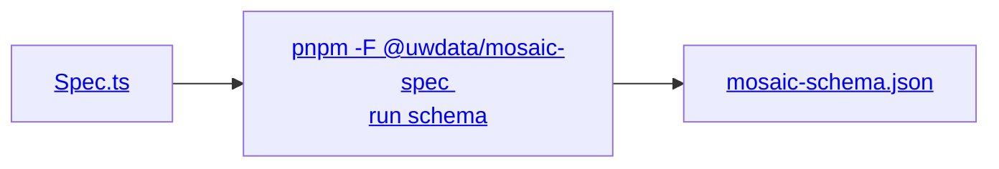

# Contributing

The entire `mosaic_spec` API is currently generated. All the fun stuff
happens *outside of* [`/src`] which can be thought of as the finished cake.

Try baking it with:

```sh
cd packages/vgplot/spec-python
pnpm generate
```

[`/src`]: ./src/mosaic_spec/__init__.py

## How it works

### Source

Life starts at [`mosaic-schema.json`], which [Mosaic Spec (TypeScript)] takes care of producing it
for us.  
The important part to know is that [`mosaic-schema.json`] encodes a TypeScript package that
lives next door.

[Mosaic Spec (TypeScript)]: ../spec/README.md
[`mosaic-schema.json`]: ../spec/dist/mosaic-schema.json
[`Spec.ts`]: ../spec/src/spec/Spec.ts



### Here

We are then tasked with converting [`mosaic-schema.json`] back into *roughly* [`Spec.ts`] but using
Python syntax.

Broadly we do this by:

1. Reading the schema into [`msgspec`] structs
2. [Transforming] their contents and splitting what was one large schema [^1] into
   [multiple smaller schemas]
3. Feeding [`datamodel-code-generator`] those schemas to generate *most* of the package, using
   [templates]
4. Hand-rolling some generation for [one module] with a [unique issue] to solve

[^1]: 200K+ lines, weighing in at over 8 MB!

[`msgspec`]: https://github.com/msgspec/msgspec
[Transforming]: ./scripts/schema_mod.py
[multiple smaller schemas]: ./schema/
[`./schema/`]: ./schema/
[`datamodel-code-generator`]: https://github.com/koxudaxi/datamodel-code-generator
[one module]: ./src/mosaic_spec/spec.py
[unique issue]: ./tools/models/mosaic.py
[templates]: ./templates/datamodel-code-generator/README.md
[`./templates/`]: ./templates/

### Project layout

Most activity takes place in [`./scripts/`] and [`./tools/`], where *ideally* a script is
mostly an arrangement of tools.

[`./scripts/`]: ./scripts/__init__.py
[`./tools/`]: ./tools/__init__.py
[`./tests/`]: ./tests/__init__.py
[Roadmap]: roadmap.md
[Jinja template]: https://jinja.palletsprojects.com/en/stable/templates/

| Where            | What                                                                         |
| ---------------- | ---------------------------------------------------------------------------- |
| [`./schema/`]    | Transformed JSON schemas, provided as input for [`datamodel-code-generator`] |
| [`./scripts/`]   | Code that is run by [`generate`]                                             |
| [`./templates/`] | [Jinja template] overrides for [`datamodel-code-generator`]                  |
| [`./tests/`]     | The test suite                                                               |
| [`./tools/`]     | Building blocks for [`./scripts/`]                                           |
| [Roadmap]        | Ideas for what's next                                                        |

## Tests

The primary output of `mosaic_spec` are the generated `TypedDict` and `TypeAliasType`s.

These guys have very little runtime behavior, so tests are focused on how this typing is understood
by multiple type checkers, which can be checked via:

```sh
cd packages/vgplot/spec-python
pnpm typecheck
```

> [!NOTE]
> `typecheck` is the final step of [`generate`]

Runtime tests are still a work-in-progress, but can be run via:

```sh
pnpm test
```

[`generate`]: #contributing
