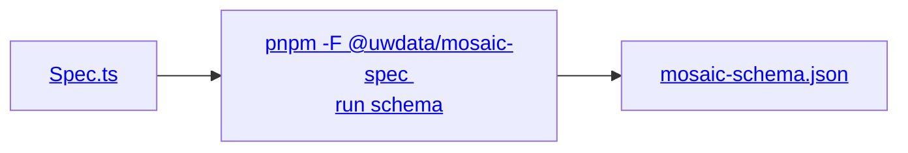

# Contributing

The entire `mosaic_spec` API is currently generated. All the fun stuff
happens *outside of* [`/src`] which can be thought of as the finished cake.

Try baking it with:

```sh
cd packages/vgplot/spec-python
pnpm generate
```

[`/src`]: ./src/mosaic_spec/__init__.py

## How it works

### Source

Life starts at [`mosaic-schema.json`], which [Mosaic Spec (TypeScript)] takes care of producing it
for us.  
The important part to know is that [`mosaic-schema.json`] encodes a TypeScript package that
lives next door.

[Mosaic Spec (TypeScript)]: ../spec/README.md
[`mosaic-schema.json`]: ../spec/dist/mosaic-schema.json
[`Spec.ts`]: ../spec/src/spec/Spec.ts



### Here

We are then tasked with converting [`mosaic-schema.json`] back into *roughly* [`Spec.ts`] but using
Python syntax.

Broadly we do this by:

1. Reading the schema into [`msgspec`] structs
2. Performing a [multi-stage IR conversion], to move from JSON Schema to Python, notably:

   i. Applying transformative [actions] once we've left JSON Schema behind.  
   Effectively, splitting what was one large schema [^1] into something that can output 14+
   modules.

   ii. Dealing with some edge cases [outside of the core workflow].
3. Generating the majority of [`/src`] directly from the [final representation]

[^1]: 200K+ lines, weighing in at over 8 MB!

<!--TODO @dangotbanned: Add a pretty diagram for IR--->

[`msgspec`]: https://github.com/msgspec/msgspec
[actions]: ./mosaic-spec.toml
[multi-stage IR conversion]: ./tools/app.py
[outside of the core workflow]: ./scripts/plugins/__init__.py
[final representation]: ./tools/ir/pyir/module.py

### Project layout

Most activity takes place in [`./scripts/`] and [`./tools/`], where *ideally* a script is
mostly an arrangement of tools.

[`./scripts/`]: ./scripts/__init__.py
[`./tools/`]: ./tools/__init__.py
[`./tests/`]: ./tests/__init__.py
[Roadmap]: ./docs/roadmap.md

| Where          | What                                                       |
| -------------- | ---------------------------------------------------------- |
| [`./scripts/`] | Code that is run by [`generate`] and other [pnpm scripts]. |
| [`./tests/`]   | The test suite.                                            |
| [`./tools/`]   | Building blocks for [`./scripts/`]                         |
| [Roadmap]      | Ideas for what's next                                      |

## Tests

The primary output of `mosaic_spec` are the generated `TypedDict` and `TypeAliasType`s.

These guys have very little runtime behavior, so tests are focused on how this typing is understood
by multiple type checkers, which can be checked via:

```sh
cd packages/vgplot/spec-python
pnpm typecheck
```

To run using a single type checker, use one of:

```sh
pnpm typecheck:ty
pnpm typecheck:pyright
pnpm typecheck:pyrefly
```

> [!NOTE]
> `typecheck` is the final step of [`generate`]

The tests defined under [`./tests/test_examples`] are [also generated], which can be re-run via:

```sh
pnpm generate:examples
```

Runtime tests are still a work-in-progress (see [Test PEPs]), but can be run via:

```sh
pnpm test
```

[`generate`]: #contributing
[pnpm scripts]: ./package.json
[`./tests/test_examples`]: ./tests/test_examples/__init__.py
[also generated]: ./scripts/prepare_examples.py
[Test PEPs]: ./docs/roadmap.md#test-peps
